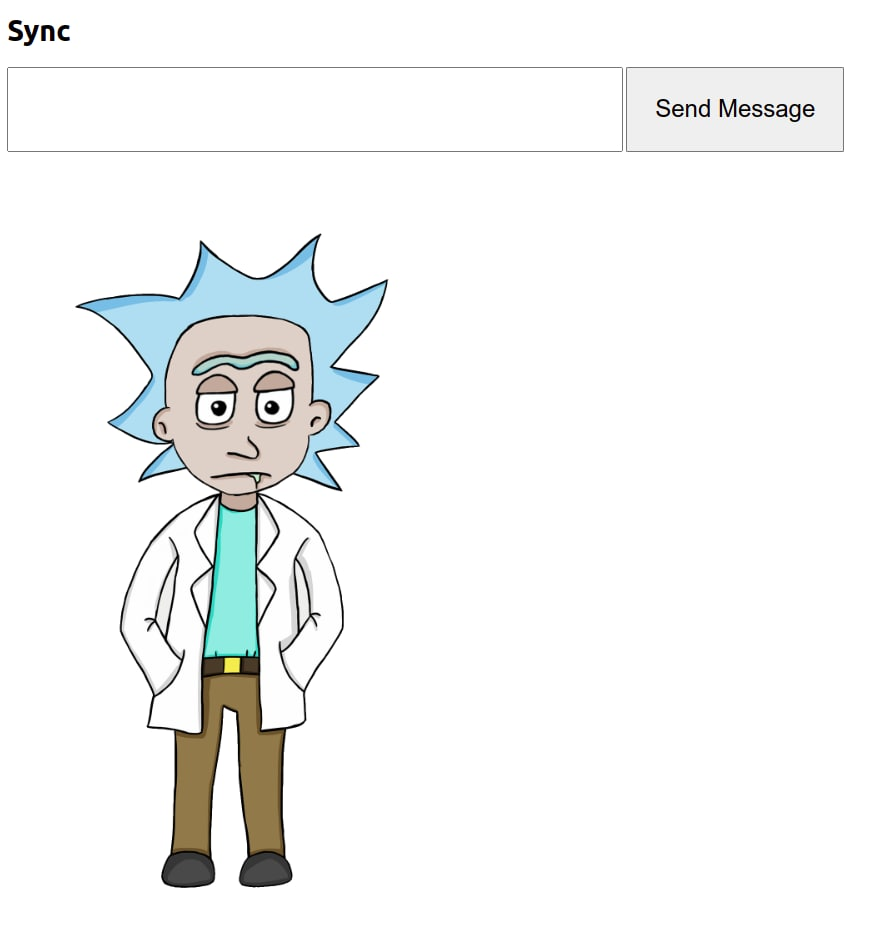

# Just a typical 2D animated engine

## Usage
`python3 server_webrtc.py`

## TODO

- [X] 2D Render Engine
- [x] WebRTC Streaming
- [X] Chatbot session management
- [x] Google Dialogflow Support
- [ ] Client-side render support
- [ ] Web UI
- [ ] Rasa Support
- [ ] Dockerization
- [ ] Render Queue
- [ ] Optimize